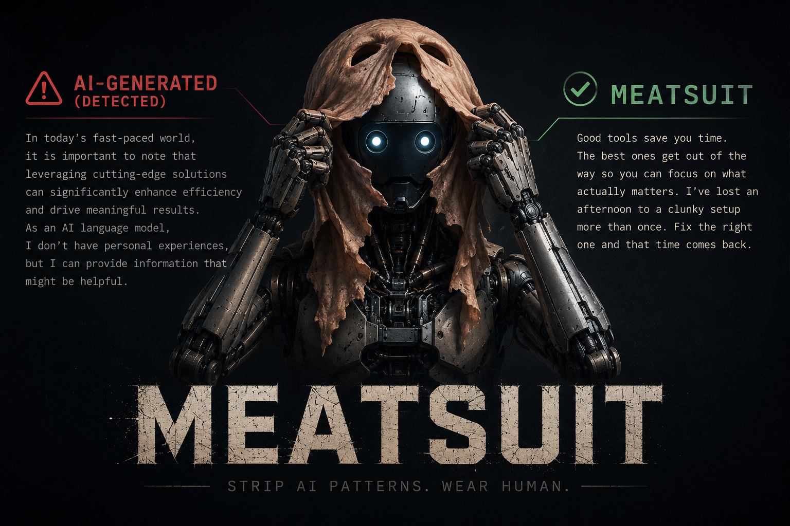

<p align="center">
  
</p>

# meatsuit

**Make AI-generated text read like a person wrote it.**

A downloadable resource that strips the statistical fingerprints of LLM writing (the inflated
vocabulary, the "it's not X, it's Y" reframes, the forced rule-of-three, the metronome rhythm,
the bullet-points-with-bold-titles) while keeping the meaning, the register, and the author's
voice. It ships two things that work together:

- **A skill** (for Claude and Codex) that edits a draft. It diagnoses the tells, rewrites them
  out, and shows its work. It never invents facts.
- **A detector** (`detector/meatsuit.js`), a zero-dependency scanner that scores how "AI" text
  reads, with no model and no network. Run it yourself in a terminal, wire it into CI, or let
  the skill use it as an objective first pass.

These are **signals, not proof.** AI-writing detectors are unreliable. They flag clean human
prose, especially from non-native speakers and in technical genres. meatsuit is a
writing-quality tool, not a verdict on who wrote something.

---

## What it catches

| | Examples |
|---|---|
| **Inflated vocabulary** | delve, tapestry, leverage, robust, seamless, pivotal, unlock the potential |
| **Reframe constructions** | "It's not X, it's Y" and "Not just X, but Y", even split across sentences |
| **Forced structure** | rule-of-three triads, bullet points with **Bold Titles:**, Title Case headings |
| **Weak verbs** | "serves as a" becomes "is", "boasts a" becomes "has" |
| **Filler** | "in today's fast-paced world," "it is worth noting that," "in conclusion" |
| **Even rhythm** | suspiciously uniform sentence length, the tell that word-lists miss |
| **Assistant residue** | "Great question!", "I hope this helps," cutoff disclaimers, `[Your Name]` |

It is deliberately disciplined about *not* over-flagging. A single em dash, one formal word, or
clean grammar is not a tell. It flags **clusters**, and it protects the things that make writing
human: specific detail, mixed feeling, bursty rhythm, real opinion. See
[references/preserve.md](references/preserve.md).

---

## Install

### As a Claude Code skill

```bash
git clone https://github.com/good3n/meatsuit.git ~/.claude/skills/meatsuit
```

Then ask Claude to "humanize this," "remove the AI tells," or "make this sound human."

### As a Claude Code / Cowork plugin

```
/plugin marketplace add good3n/meatsuit
/plugin install meatsuit
```

Or drag `dist/meatsuit.skill` into Claude.ai, under Settings, Capabilities, Skills.

### For Codex (and other coding agents)

The same rules live in [AGENTS.md](AGENTS.md). Point your agent at the repo, or copy `AGENTS.md`
and `references/` into your project root.

### As a standalone detector

```bash
npx meatsuit draft.md                 # human-readable report
npx meatsuit draft.md --json          # machine-readable
npx meatsuit draft.md --context technical
cat draft.md | npx meatsuit           # from stdin
```

No install needed beyond Node 18+. The detector is one file with zero dependencies. It exits
non-zero when text scores Moderate or worse, so it drops straight into a CI step.

---

## How the skill works

1. **Read for voice.** Notice how the piece is meant to sound before changing anything.
2. **Scan.** Run the detector for an objective first pass, then read for the judgment-heavy
   tells it can't catch (cross-sentence reframes, weak metaphors, vague attribution).
3. **Rewrite.** Fix what was found, never swapping one banned word for another.
4. **Self-audit.** Re-read and ask "what still reads as AI?", without overcorrecting into
   clipped, voiceless prose, which is its own tell.
5. **Verify.** No fabricated facts, em dashes gone from copy, nothing dropped, no assistant
   residue. Re-run the detector to confirm.

Output comes back in four blocks (**Diagnosis**, **Rewrite**, **Changes**, **Notes**) so you
learn the patterns over time.

The substance lives in [`references/`](references/): the
[vocabulary](references/banned-vocabulary.md), the [structures](references/banned-structures.md),
the [rewrites](references/rewrites.md), the [examples](references/examples.md), and the
[restraint rules](references/preserve.md). The skill loads them on demand.

---

## The detector, in one minute

```js
const { scan } = require('./detector/meatsuit.js');

const result = scan("In today's fast-paced world, we leverage robust solutions.");
// { score, label: 'Heavy', issues: [ { type, text, severity, suggestion, line }, ... ] }
```

It normalizes common bypass tricks (zero-width characters, look-alike letters) and treats their
presence as corroborating evidence. Vocabulary is flagged in three tiers (always, on clustering,
or on density) so single legitimate uses pass. Every issue type is documented in
[detector/CATEGORIES.md](detector/CATEGORIES.md), and a test enforces that the docs and code
never drift. See [detector/README.md](detector/README.md).

---

## What it is not for

Generating from a blank page. Fact-checking logic or truth. Censoring legitimate technical
vocabulary. Guaranteeing any AI-detector outcome. It makes writing read better. It does not
certify authorship.

To be clear about "blank page": meatsuit edits text you already have, but that text does **not**
need to be finished or polished. A rough draft, messy notes, or a few bullet points are plenty —
you bring the raw material and the real facts, and meatsuit strips the machine tells. The only
thing it won't do is conjure a piece out of nothing.

---

## Develop

```bash
npm test          # detector behavior + category contract
npm run scan -- draft.md
npm run sync      # regenerate the plugin copy from source
npm run build     # rebuild dist/meatsuit.skill
npm run check     # full gate: tests + sync + dogfooding
```

The root `SKILL.md` and `references/` are the single source of truth. The plugin tree and the
`.skill` bundle are generated, so don't edit them by hand.

Contributions welcome, especially new tells. The bar is evidence: see
[CONTRIBUTING.md](CONTRIBUTING.md).

## License

MIT. Use it, copy it, modify it, ship it. See [LICENSE](LICENSE).
